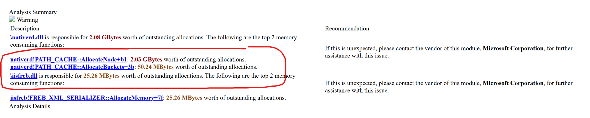
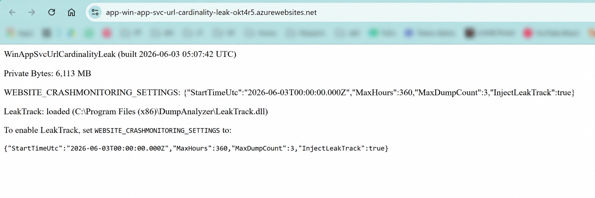

# win-app-svc-url-cardinality-leak

Minimal reproduction showing that all Azure Windows App Services leak native memory when serving high-cardinality URL paths — regardless of application code.

## Executive Summary



**The leaking module is `nativerd.dll`** — the IIS Native Request Handler. This is a core IIS DLL (shipped by Microsoft, not Azure) responsible for resolving incoming HTTP request URLs against the IIS site and application configuration. It translates raw URL paths into IIS metabase paths of the form `MACHINE/WEBROOT/APPHOST/<site>/<path>` so IIS knows which handler to dispatch to.

Inside `nativerd.dll` is a class called `PATH_CACHE`. Its job is to cache the result of URL-to-metabase-path lookups so that repeated requests to the same URL path are resolved cheaply. To do this it calls two functions: `PATH_CACHE::AllocateNode` — which allocates a trie node for each unique URL path segment — and `PATH_CACHE::AllocateBuckets` — which allocates the hash bucket arrays those nodes live in.

**The bug:** these allocations are never freed for paths that are not re-used. Every request to a URL path that has not been seen before causes `nativerd.dll` to allocate a new trie node (≈ 304–352 bytes of native heap, sized to the URL length) for each segment of the path and to add it to the `PATH_CACHE`. The cache has no eviction policy and no size cap. Once allocated, a node is held for the lifetime of the worker process. On an application that serves high-cardinality URLs — unique entity IDs, GUIDs, or user-generated slugs — the cache grows without bound, one native block per path segment per unique request, and the process's private bytes climb linearly until it is recycled or crashes.

The DebugDiag report above is the direct evidence: `nativerd.dll` holds **2.08 GB** of outstanding native allocations, entirely dominated by `PATH_CACHE::AllocateNode` (2.03 GB) and `PATH_CACHE::AllocateBuckets` (50 MB). The application code itself plays no role — the leak occurs before any managed code runs.

Full DebugDiag analysis report: [debugdiag-report.mht](artefacts/debugdiag-report.mht)

---

Minimal ASP.NET Core 8 app reproducing a native memory leak in IIS in-process hosting on Windows Azure App Service — does not reproduce on Linux.

**Trigger:** Every request to a unique URL path leaks ~320 bytes of unmanaged memory per path segment, regardless of application code. The leak is in the IIS/Windows hosting layer, not in .NET.

---

## Prerequisites

- [.NET 8 SDK](https://dotnet.microsoft.com/download)
- [Azure CLI](https://learn.microsoft.com/en-us/cli/azure/install-azure-cli)
- PowerShell 7+
- An Azure subscription

---

## Deploy

### 1. Provision infrastructure

```powershell
.\deploy\provision.ps1
```

Creates a resource group, Premium V3 App Service plan, and web app. Safe to re-run (idempotent). You will be prompted to log in and select a subscription.

The default SKU is **P2v3**. Edit `$appServicePlanSku` in `provision.ps1` to change it.

### 2. Publish the app

```powershell
.\deploy\publish.ps1
```

Builds a framework-dependent win-x64 release, zips it, and deploys via `az webapp deploy`.

---

## Reproduce the leak

```powershell
.\test\load-test.ps1 -BaseUrl https://<your-app>.azurewebsites.net
```

| Parameter | Default | Description |
|---|---|---|
| `-BaseUrl` | *(required)* | App Service URL |
| `-Concurrency` | `200` | Parallel workers |
| `-SegmentCount` | `35` | Path segments per request — each leaks one native block |
| `-DurationSec` | `0` | Run duration in seconds; `0` = run until Ctrl+C |

The script prints req/s, error count, and private bytes every 5 seconds:

```
[00:30]   312.4 req/s | requests=     1562 err=     0 | private bytes=   184 MB
[01:00]   318.1 req/s | requests=     3153 err=     0 | private bytes=   271 MB
```

### What to watch

**Azure Portal → App Service → Monitoring → Metrics → Private Bytes (Max, 1-min)**

You should see a steady, linear climb that does not plateau. Stop the load test and observe that private bytes do not drop — confirming unmanaged memory that is never reclaimed.



---

## How the leak works

Each request URL has the shape `/{guid}/{rand}/{rand}/...` — the GUID at depth 1 ensures every prefix chain is globally unique. The hosting layer allocates a native block for each URL prefix level and does not free them. With 35 segments per request and 200 concurrent workers, native memory grows at roughly 15–20 KB/request.

The application code itself (`Program.cs`) is intentionally trivial — a catch-all route that returns 200 OK — to rule out any application-level cause.

---

## Environment

Leak confirmed on the following platform. Versions are recorded here so the report can be dated and matched against future fixes.

| Component | Value |
|---|---|
| Dump captured | 2026-04-29 19:29 UTC |
| OS | Windows Server 2022, build 20348 |
| IIS | 10.0.20348 |
| ASP.NET Core runtime | 8.0.25 |
| `aspnetcorev2_inprocess.dll` | 18.0.26044.25 (ships with ASP.NET Core 8.0.25) |
| `aspnetcorev2.dll` (platform/IIS module) | 13.1.19331.0 (Azure App Service platform-managed) |
| Hosting model | IIS in-process |

**Note on module attribution:** The leak is in the IIS in-process hosting layer, but the exact module responsible is unconfirmed without private symbols. Azure Windows App Service injects additional native modules into the IIS pipeline (`ModSecurity IIS`, `iisnode`, `ApplicationRequestRouting`, `RewriteModule`, and others) alongside `AspNetCoreModuleV2`. Any of these could be the source of the unreleased native request structures.

---

## Anatomy of a leaked block

This section documents the internal structure of the leaked native objects as recovered from a production process dump (w3wp.exe, 13 days uptime, ~34.8 million leaked objects, ~11.4 GB native heap growth).

### LFH bucket distribution

Block size correlates directly with URL path length. Four sizes dominate:

| Bucket | Block size | URL length | Leaked blocks | Heap cost |
|--------|-----------|------------|---------------|-----------|
| 0x130  | 304 bytes | ≤ ~100 UTF-16 chars | ~3,848,000 | ~1.17 GB |
| 0x140  | 320 bytes | ~104–108 chars | ~16,100,000 | ~5.15 GB |
| 0x150  | 336 bytes | ~112–116 chars | ~7,686,000 | ~2.58 GB |
| 0x160  | 352 bytes | ~120–124 chars | ~7,168,000 | ~2.52 GB |
| | | **Total** | **~34,802,000** | **~11.42 GB** |

### Block layout

Every leaked object shares the same fixed layout. The discriminator used to identify them is a **self-pointer at offset +0x48** that always points to `block_address + 0x68` — the start of the inline UTF-16LE URL string.

```
Offset  Size    Content
------  ------  -------------------------------------------------------
+0x00   8 B     Binary header / internal cookie (varies per block)
+0x08   8 B     Type tag — high byte: 0x96 / 0x8c / 0x8e / 0x90
                          low 16 bits: monotonically-incrementing alloc ID
+0x10   8 B     Pointer → external heap object (parent / context)
+0x18   8 B     Pointer → external heap object
+0x20   8 B     Pointer → external heap object
+0x28   8 B     Pointer → external heap object
+0x30   8 B     null
+0x38   8 B     null
+0x40   8 B     null
+0x48   8 B     *** SELF-POINTER → (this + 0x68) ***
                Points to the inline URL string immediately below
+0x50   8 B     Opaque value (observed: timestamp or monotonic ID)
+0x58   8 B     High DWORD = 0x00000100 (constant); low DWORD varies
+0x60   4 B     Small integer — observed values: 7 or 8
+0x64   4 B     Secondary tag / cookie
+0x68   var     UTF-16LE null-terminated string:
                MACHINE/WEBROOT/APPHOST/<site-name>/<url-path>
  ...   var     Null terminator + padding to block end
```

### Raw hex example (320-byte block at `0x00000292802fb0b0`)

```
00000292`802fb0b0  e2 9b 0e 6d 2d 74 f8 6f  1a 5e 32 98 e1 00 00 96  ; +0x00 header | +0x08 tag (0x96)
00000292`802fb0c0  50 43 d5 c5 b8 02 00 00  50 16 69 c0 b5 02 00 00  ; +0x10 ptr     | +0x18 ptr
00000292`802fb0d0  80 e1 2f 80 92 02 00 00  40 40 4c c0 b5 02 00 00  ; +0x20 ptr     | +0x28 ptr
00000292`802fb0e0  00 00 00 00 00 00 00 00  00 00 00 00 00 00 00 00  ; +0x30 null    | +0x38 null
00000292`802fb0f0  00 00 00 00 00 00 00 00  18 b1 2f 80 92 02 00 00  ; +0x40 null    | +0x48 self-ptr → +0x68
00000292`802fb100  e7 10 1a 6a 79 da fc 3f  ee 0c 1c 2a 00 01 00 00  ; +0x50 opaque  | +0x58 (0x100 constant)
00000292`802fb110  07 00 00 00 fe 95 ed b7  4d 00 41 00 43 00 48 00  ; +0x60 int=7   | +0x68 ← string start: "M A C H"
00000292`802fb120  49 00 4e 00 45 00 2f 00  57 00 45 00 42 00 52 00  ;  "I N E /     W E B R"
00000292`802fb130  4f 00 4f 00 54 00 2f 00  41 00 50 00 50 00 48 00  ;  "O O T /     A P P H"
00000292`802fb140  4f 00 53 00 54 00 2f 00  -- -- -- -- -- -- -- --  ;  "O S T /     <site-name> ..."
00000292`802fb150  -- -- -- -- -- -- -- --  -- -- -- -- -- -- -- --  ;  (UTF-16LE URL path continues)
  ...                                                                 ;  ...
00000292`802fb1b0  00 00 ...                                          ;  null terminator
```

Decoded string at +0x68:
```
MACHINE/WEBROOT/APPHOST/<site-name>/entities/12345678/AbCdEfGhIjKlMnOpQrSt01/seg-a
```

The self-pointer at +0x48 (`00000292802fb118`) = block base (`00000292802fb0b0`) + `0x68` ✓

### Inline URL string format

The string at +0x68 is always the IIS metabase application path followed by the full request URL path:

```
MACHINE/WEBROOT/APPHOST/<site-name>/<url-path>
```

`MACHINE/WEBROOT/APPHOST/` is the fixed IIS metabase prefix used exclusively by IIS and HTTP.SYS internally. The presence of this prefix in every leaked block — and the one-to-one correspondence with request throughput — is the primary evidence that these are native IIS/HTTP request path structures, not managed objects or telemetry buffers.

### URL length → bucket size mapping

The four dominant LFH bucket sizes map directly to URL path variants:

| Bucket | Example path suffix | Decoded |
|--------|--------------------|-----------------------|
| 0x130 (304 B) | `entities/12345678/AbCdEfGhIjKlMnOpQrSt01/seg-a` | 4 segments |
| 0x140 (320 B) | `entities/12345678/AbCdEfGhIjKlMnOpQrSt01/seg-a/seg-b` | 5 segments |
| 0x150 (336 B) | `entities/12345678/AbCdEfGhIjKlMnOpQrSt01/seg-a/seg-b/seg-c` | 6 segments |
| 0x160 (352 B) | `entities/12345678/AbCdEfGhIjKlMnOpQrSt01/seg-a/seg-b/seg-c/seg-d` | 7 segments |

Every block across all samples contained a real HTTP request path — one leaked block per request, confirming the leak is one native structure per HTTP request that is never freed.
